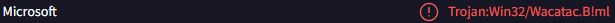

# S2Tweaker — S.T.A.L.K.E.R. 2 Mod Generator

A Windows GUI tool that builds a personal tweak mod (`.pak`) for
**S.T.A.L.K.E.R. 2: Heart of Chornobyl** from sliders and checkboxes —
no modding knowledge needed.

**Open source (MIT).** Everything in this repo was written by Claude
(Anthropic's AI) — the project owner can't code and considers this a working
**concept** for people who can: fork it, improve it, find bugs, build on it.
Everyone is free to use it. This README tells you everything you need.

## What it does

- Reads the **vanilla values from YOUR installed game version** (extracts the
  needed `.cfg.bin` GameData from `pakchunk0` and decodes it) — so multiplier
  tweaks stay correct after game patches.
- Generates **`{bpatch}` config patches** (the official patch system since
  game version 1.6): only the values you change are written; everything at
  "(vanilla)" is untouched and cannot conflict with other mods.
- Packs them into `zzz_<Name>_P.pak` with its own pure-Python pak writer (pak V8B, mount point
  `../../../`) — into an `output` folder, or directly into `~mods`.
- Fully **portable**: settings, cache and output live next to the exe.

~250 tweaks in 13 tabs (Player, Vaulting, Weight & items, Combat, NPCs & AI,
Mutants, Factions, Weapons, Ammo, Armor, World, Economy, Traders), plus per-weapon overrides
for 91 weapons (unique named guns and the Pre-order/Deluxe/Ultimate
edition guns included), per-round overrides for 34
ammo types and per-piece
overrides for 57 armors/helmets (edition armor included): health/stamina/regen, per-action
stamina costs, fall damage, movement speed, jump height, carry weight +
penalty threshold, item weights per category, player/NPC/mutant damage &
health (incl. a per-species mutant tree with health/speed/damage/regen
and bloodsucker cloaking; mutant health regen ×0 = the mutant version
of "NPCs don't self-heal"),
headshots, explosions, armor protection per damage type, weapon damage/
spread/recoil/durability/fire rate/range/bleeding/ADS move speed/ADS
aim-in speed/magazine size on three levels, technician upgrade locks (take both / no blueprint / no tiers), A-Life spawns (lair population, respawn, encounter frequency, mutant share, pack size, per-species weights), day length, consumable effect duration, artifacts per field + respawn, weightless quest items, NPC combat behaviour (guaranteed-hit shots, burst length, fire pauses, engagement range, NPC weapon range, NPC regen), stealth (crouch, movement noise, weather, flashlight), NPC awareness & nerve (alertness, search time, courage, stagger, attack cooldowns, weapon rank bonus), NPC flashlights (brightness & reach, beam width, use in combat, on/off hours), melee damage & range, interaction reach & talk distance, save slots & autosave interval, jamming, scoped sway,
breath hold, repeatable-quest cooldown, ammo
damage/armor piercing/armor damage/cover penetration, NPC accuracy/vision/
hearing/grenades, NPC gear quality (tilts squad loadout rolls toward
the pricier gear in their vanilla pools), faction relations
(player-vs-faction and faction-vs-faction baselines plus reputation
rollback time, reaction strength and the trading threshold),
artifacts & detectors, anomaly/radiation/bleeding,
hunger/sleep rates, weather & emissions (frequency and duration),
loot amounts in stashes, on bodies
and in the world's item generators, dropped-weapon condition (average +
vanilla-style random spread, or exact), trader prices & min. durability,
trader stock amount/variety/restock and wallets, repair/upgrade costs,
fast travel, quest rewards.

The override trees add up to 720 weapon and 100 ammo sliders (plus the
armor, faction and mutant trees) on top of the fixed ones — they are
built lazily when you expand a category, so startup stays fast.

## How it works (the important mechanics)

| Layer | Details |
|---|---|
| Network | **None.** Since 1.19.2 the program contains no networking code at all — no `urllib`, no sockets, no HTTP client — and since 1.23.0 there is no bundled helper program at all: pak files are read and written by [s2tweaker/pakfile.py](s2tweaker/pakfile.py) in plain Python. Both are enforced on every build ([tests/test_no_network.py](tests/test_no_network.py), [tests/test_no_download.py](tests/test_no_download.py)) and can be verified with one `grep` of this repository. The update check was removed with 1.19.2: Nexus' file submission guidelines prohibit internet-connecting executables "unless where it is crucial" and say "'auto update' functionality does not qualify as crucial". Updating is a manual file swap. |
| Vanilla data | The needed GameData files are read straight out of `pakchunk0-Windows.pak` by [pakfile.py](s2tweaker/pakfile.py) (index parsed, only those entries decompressed), then `.cfg.bin` → text via the vendored decoder ([s2tweaker/vendor_bin2cfg.py](s2tweaker/vendor_bin2cfg.py)). Cached in `cache/vanilla-<pakSize>-s<schema>/`; a game update changes the fingerprint → automatic re-extraction. |
| Oodle | The game's config archives are Oodle-compressed, so reading them needs the proprietary `oo2core_9_win64.dll`. The game does **not** ship it (Oodle is linked into the game executable), and **S2Tweaker never downloads it**: a program that pulls a library off the internet and then runs it looks exactly like a dropper, which is one reason scanners flag tools like this. The user places the file once; the tool looks in the usual local spots, always verifies the SHA-256, and says so at startup with a link and a target folder if it is missing. The DLL is loaded through `ctypes` only after its SHA-256 matched. Packing never needs Oodle. |
| Ammunition swap | Per weapon, in the overrides tree: `AmmoCaliber` plus the `ProjectilePrototypeSID` of every existing `AmmoTypeProjectiles` slot in `WeaponGeneralSetupPrototypes` — the same struct `MaxAmmo` already lives in, so no new game file and no cache bump. Only existing slots are rewritten, never added or removed (whether `{bpatch}` can grow an array is untested in-game). The sort is read per index, never inferred from position: six sniper rifles carry `Supersonic` on `[0]`. The offered calibers are harvested from the weapon data, so 7.62×39 — real ammunition that no weapon uses and no generator drops — never appears. Nothing is blocked: damage lives on the weapon (`BaseDamage`), the round only multiplies, and that multiplier is 1.0 for every rifle and pistol caliber but 0.084 for 12 gauge, which shotguns offset with a much higher base value. Broken combinations are allowed and labelled with the computed factor. |
| Parsing | [cfgparse.py](s2tweaker/cfgparse.py) parses GSC's cfg text format (`Name : struct.begin {refkey=...}` … `struct.end`) into a tree; `refkey` inheritance chains are resolved to get effective vanilla values. |
| Patch output | [emit.py](s2tweaker/emit.py) writes `{bpatch}` structs. Patch files follow the proven convention `<BaseCfg>/<BaseCfg>_patch_<Mod>.cfg` under `Stalker2/Content/GameLite/GameData/`. |
| Packing | [pakio.py](s2tweaker/pakio.py) stages the files and [pakfile.py](s2tweaker/pakfile.py) writes the pak (exactly what the game wants: V8B, mount `../../../`, uncompressed, SHA-1 per entry). Verified against repak 0.2.3: same index, same entries, same hashes, and repak reads the result. |
| Key game files | `ObjPrototypes` (player + mutants), `ItemPrototypes`, `TradePrototypes`, `DifficultyPrototypes` (per-difficulty multiplier groups), `EffectPrototypes` (overweight effects), `FloatProviderPrototypes` (scope-sway constant — patched instead of the sway effects so offset-aiming keeps working), `WeaponData/*` (damage, wear, spread, recoil), `CoreVariables` (repair costs, stamina drain), `ObjWeightParamsPrototypes` (carry weight), `ObjHoldBreathParamsPrototypes`, `StashPrototypes` (smart loot in stashes and on bodies), `ItemGeneratorPrototypes` (9.3 MB — the world's loot generators; only `MinCount`/`MaxCount` under `PossibleItems` is scaled, and only on generators that pass a two-stage safety filter, see below), `RelationPrototypes` (faction relations: 582 pair baselines + the RelationVersion counter the patch raises so saves notice changes — research: [docs/FACTION_RELATIONS_RESEARCH.md](docs/FACTION_RELATIONS_RESEARCH.md)). |

Deep research notes with sources, vanilla values and risk analysis:
[docs/SPEC.md](docs/SPEC.md).

## The ~mods pre-scan

On request the tool scans the OTHER mods in the game's `~mods` folder (never
without asking — overhaul paks can be 2 GB) and tells the user in plain
language which of its own settings those mods also change. Affected sliders
keep a colored dot: blue while the slider sits at (vanilla) ("also changed by
X"), violet once the user moves it ("X changes this too — your value wins",
because the tool's `zzz_` pak loads last). "Reset all to vanilla" keeps the
dots — the foreign mods are still installed; only a re-scan updates them.

Mechanics ([modscan.py](s2tweaker/modscan.py)): per pak only the cfg entries
under `GameData`/`DLCGameData` are listed (recursively — UE5 mounts `~mods`
subfolders too, and players commonly sort their mods into subfolders) and
extracted in one
batched, glob-escaped `repak` call (`.cfg.bin` is converted; the official
`Base.cfg_patch_<Mod>` naming without a trailing `.cfg` counts as a config
too). Mods with an IoStore container next to the pak (`.utoc`/`.ucas` —
typical for Steam Workshop items) are scanned through their `.pak` part, which
is where UE5 keeps loose files such as cfg patches; only the packed assets stay
uninspected, and the result says so per mod. Duplicate Workshop layouts (old
and new path, same mod name) are merged into one entry. Each slider's "footprint" is
computed dynamically — `build_patches()` probed in BOTH directions (×2 and
×0.5, so capped values are covered) — and compared against the mod's content
on the level of (top-level struct + leaf key), deliberately not the full
path: foreign mods patch the same values through different file layouts.
Three refinements keep the matches honest: legacy `refkey` patches under a
free struct name are counted under their target prototype; full-file copies
are value-compared against vanilla so a 60 MB overhaul only marks what it
actually changes; and re-emitted anchor keys (`Type`) plus the ambiguous
nested `Weight` are excluded from the comparison. Expensive footprints (the
9.3 MB loot file, the 1,601-prototype no-heal walk) are only computed when a
scanned mod plausibly touches them. The scan runs in a worker thread against
a GameData snapshot; Browse/Reload are locked while it runs. If a foreign
pak sorts alphabetically AFTER the tool's `zzz_` pak, the tooltip and the
results dialog say so instead of claiming "your value wins".

## The loot-amount safety filter

`ItemGeneratorPrototypes.cfg` holds 3,085 loot generators, and the same field
names (`MinCount`/`MaxCount`) mean *stack size* under `PossibleItems` and
*coupons* under `MoneyGenerator`. There is no quest flag in that file at all,
so [gamedata.py](s2tweaker/gamedata.py) filters in two stages before anything
is patched (`loot_generators()`):

1. **By name**, on both the struct key *and* its SID: story/quest prefixes
   (`MQ`/`EQ`/`SQ`/`RSQ`/`ANCQ`), `Reward`, `Container`, `BP_`, `UAID_`,
   `Key`, `Safe`, `PDA`, `Icon`, `Boss`, `Player`, `Template`, `Trade` …
2. **By content**: every `ItemPrototypeSID` in the block is resolved against
   `ItemPrototypes.cfg`. If one of them is a quest item, matches the
   unique-weapon pattern `^Gun_[A-Z]`, or cannot be found there at all, the
   whole generator is dropped. Both quest markers count — `IsQuestItem` and
   `IsQuestItemPrototype`; 291 items carry only the second one, among them the
   note PDAs wired to `OnPlayerGetItemEvent`.

Two item kinds are skipped per *entry* instead, so the rest of an otherwise
ordinary generator still scales: **money cards** (identified live by their
pickup effect `EEffectType::AddMoney`, not by name — currency exists as a
regular item in `PossibleItems`, not just in the `MoneyGenerator` branch) and
items whose *name* matches the quest pattern without carrying a quest marker
(in practice the invisible `GuardQuestItem` marker on 31 guard generators).

Plus the structural exclusions: the base template `[0]` (1,773 generators
inherit from it) and the developer `All*` generators that already ship with
`MinCount = 900`. Trader stock is excluded as well, but carefully: the
transitive hull is taken only from generators `TradePrototypes.cfg` actually
references, while generators that merely carry "Trade" in their name are
excluded themselves without propagating — otherwise a single bartender drags
`GeneralNPC_Consumables_*` out with it, and those blocks supply the medicine
and food of 239 and 281 ordinary NPCs.

Stage 1 alone provably leaks quest keys and unique weapons, which is why both
stages are mandatory. Struct keys, slot keys and array indices are always read
from the file — 226 generators are keyed `[N]` rather than by their SID, and
724 slots are named (`Head`, `BodyArmor`, …) instead of indexed, so a
constructed path would create a new node instead of patching an existing one.

What survives on the current game data: **2,026 of 3,085 generators**, 3,310
scalable count entries, and at 200 % a patch of about 25,000 lines — by far
the largest file the tool produces. (`GamePass` is deliberately NOT a
blacklist token: the 17 `GamePass_Stash_*` tables are ordinary base-game
world stashes — 167 live containers on the main map, content-identical to
the `Stash_Cheap/Medium/Expensive` tables — and the content check plus the
money skip cover them fully.)

## Project structure

```
main.py                 entry point for development (python main.py)
s2tweaker/
  gui.py                customtkinter GUI (dark, English)
  tweaks.py             Settings dataclass + one builder per feature
  gamedata.py           extraction pipeline, parsing, inheritance resolution
  cfgparse.py           GSC cfg text parser
  emit.py               {bpatch} cfg writer
  pakfile.py            pak reader/writer in pure Python (V1-V11 read, V8B write, Oodle via ctypes)
  pakio.py              pack/unpack/list on top of it, Oodle DLL lookup (never a download)
  game.py               game folder auto-detection (Steam/GOG/Xbox)
  vendor_bin2cfg.py     cfg.bin → cfg decoder (vendored, public domain)
tools/build_exe.py      assembles the program folder dist/S2Tweaker/ (no PyInstaller)
tools/launcher.py       shipped as _internal/sitecustomize.py: starts the GUI
docs/SPEC.md            research: every tweak's mechanism + sources
release/README.txt      end-user readme shipped with the program
THIRD_PARTY_LICENSES.txt licences of the bundled components
test_generate.py        end-to-end dev test (builds a test pak)
build.bat               runs tools/build_exe.py
```

## Building from source

```
pip install -r requirements.txt
python main.py          # run the GUI directly
build.bat               # or assemble dist/S2Tweaker/ (needs a python.org install)
```

**There is no repak.exe since 1.23.0.** Until 1.22.0 the folder carried a repak binary compiled from source by the CI, the only unsigned executable in the package. On 2026-09-05 Microsoft's machine-learning engine flagged two such builds as trojans although they differed in 27 bytes of linker timestamp and PDB GUID only. Rather than fight a classifier that dislikes the shape of an unsigned Rust binary, the pak handling moved into Python: [s2tweaker/pakfile.py](s2tweaker/pakfile.py) reads pak versions 1 to 11 (Zlib, Gzip, Oodle) and writes V8B, using nothing but the standard library. [tests/test_pakfile.py](tests/test_pakfile.py) checks it against the real game: the 36 needed files come out byte for byte as repak extracted them, 27 third-party mod paks read identically, and a pak we write has the same index, entries and hashes as repak's.

**There is no PyInstaller since 1.21.0.** `S2Tweaker.exe` is `pythonw.exe`
from python.org, byte for byte, signed by the Python Software Foundation;
`python3XX._pth` next to it pins the module search path to `_internal`,
and `_internal/sitecustomize.py` (that is `tools/launcher.py`) starts the
GUI. The tool's own code ships as readable `.py` files, the standard
library as a `.pyc` zip compiled from the same python.org installation —
without `socket`, `ssl`, `asyncio` and `sqlite3`, and without any OpenSSL
library, so the package has no networking capability at all. Every DLL,
PYD and EXE in the folder is signed by the PSF or Microsoft except
nothing - there is no unsigned executable left.

Why: the PyInstaller builds kept tripping antivirus heuristics. 1.20.0 was
flagged by two engines on VirusTotal although its launcher was byte for
byte PyInstaller's official `runw.exe`, which is clean on its own — the
detections were aimed at the archive PyInstaller appends, i.e. at
PyInstaller itself. The price of the switch is cosmetic: the exe shows the
Python icon and Python's version info, because changing either would break
the signature. The tool stays portable: settings, cache, presets and output
are created next to the exe.

`tools/build_exe.py` verifies its own output (signatures, hash equality
with `pythonw.exe`, forbidden files) and then starts a copy of the folder
once as a self-test; `tests/test_build_layout.py` runs the whole build and
checks the layout.

Python 3.12+ recommended. For development, the GUI prefers a local
`vanilla/Stalker2/Content/GameLite/GameData/` folder if present (create it by
running the tool once and copying the contents of `cache/vanilla-*/`), else
it extracts from the game on "Confirm & load game data".
`python test_generate.py` builds a test pak with many tweaks active.

### The antivirus story so far

| Version | What the scanners said | What changed |
|---|---|---|
| up to 1.20.0 | the PyInstaller launcher was flagged by Microsoft and Zillya (heuristics on the archive PyInstaller appends) | folder build, no downloads, no network code |
| 1.21.0 | 0 detections: the launcher is the PSF-signed `pythonw.exe` | PyInstaller gone |
| 1.22.0 | `repak.exe`, compiled from source by the CI, flagged as `Trojan:Win32/Wacatac.B!ml`; its twin build, 27 bytes apart, was clean at first and flagged a few hours later | 1.21.0 and 1.22.0 withdrawn |
| 1.23.0 | ZIP 0 / 66, no unsigned executable left | pak code rewritten in Python |



**From the author:** I hate Microsoft for this. A machine-learning verdict with no explanation, on a file compiled in public from open source, flipping between "clean" and "trojan" for two builds that differ in a timestamp. And no, I am not buying a damn code-signing certificate to make it stop: it costs money every year, it would put my real name on every file, and Microsoft itself says that even the expensive EV kind no longer buys SmartScreen reputation. The answer is to ship nothing a classifier can guess about: readable code, and binaries signed by the Python Software Foundation.

## Adding a new tweak (3 steps)

1. **[tweaks.py](s2tweaker/tweaks.py)** — add a field to `Settings`
   (default = vanilla), then write/extend a builder that emits a `{bpatch}`
   dict only when the value deviates (`_neq(...)`), using vanilla values read
   via `gd.resolve(...)`. Add a line to `summarize()`.
2. **[gamedata.py](s2tweaker/gamedata.py)** — if you need a GameData file that
   isn't extracted yet, add it to `NEEDED_FILES` and **bump `CACHE_SCHEMA`**
   (this invalidates old caches automatically).
3. **[gui.py](s2tweaker/gui.py)** — add a `self._slider(...)` /
   `self._check(...)` row in `_build_body()` and map it in `_collect()`.
   Two exceptions to that recipe: the per-weapon sliders (`IwWeaponRow`) and
   the per-ammo sliders (`IaAmmoRow`) are built directly as `SliderRow(...)`
   and are deliberately **not** registered in `self.sliders` — they live in
   `self.weapon_overrides` / `self.ammo_overrides`.

Golden rule: patch only what the user changed, compute from vanilla values of
the *installed* version, and never hardcode game numbers.

## Legal / contributor notes

- **Never commit or upload extracted game files** (`vanilla/`, `cache/`) —
  that content is copyrighted by GSC Game World. `.gitignore` covers this.
- Released builds are produced by GitHub Actions from this repository, not
  on a personal machine — see the
  [code signing policy](docs/CODE_SIGNING_POLICY.md) for who builds and
  approves a release, and for the two third-party binaries involved.
- Tool code is MIT (see [LICENSE](LICENSE)). Bundled: repak (MIT OR
  Apache-2.0), cfg.bin decoder based on public-domain code by
  joric/sdwvit/thexii, the Python runtime (PSF licence), Tcl/Tk (BSD-style),
  customtkinter (MIT), darkdetect (BSD-3), packaging (Apache-2.0 OR BSD-2).
  Their licence texts ship with the tool in `_internal/licenses/`, listed in
  [THIRD_PARTY_LICENSES.txt](THIRD_PARTY_LICENSES.txt); the repak MIT notice
  is also reprinted in `release/README.txt` (the file inside the player ZIP).
- Known limits: DLC items aren't covered by the per-item weight slider;
  iron-sight sway is animation-driven (not cfg-tweakable); the in-game
  "Custom Rules" difficulty overlaps some multipliers (precedence untested).

## Credits

- [repak](https://github.com/trumank/repak) by trumank
- [bin2cfg](https://github.com/joric/stalker/wiki) by joric,
  [S2CfgToJSON](https://github.com/sdwvit/S2CfgToJSON) by sdwvit (+ thexii)
- The S.T.A.L.K.E.R. 2 modding community for documenting the `{bpatch}`
  system, and GSC Game World for the game.
